# 🚁 드론 기반 조난자 탐지 시스템 (YOLOv8 + Hailo-8 NPU)

라즈베리파이5와 YOLOv8을 활용하여 드론에서 실시간으로 조난자를 탐지하는 시스템입니다.  
단순 구현을 넘어 **실제 현장 문제를 발견하고 해결하는 과정**을 담았습니다.

---

## 📌 프로젝트 개요

| 항목 | 내용 |
|------|------|
| 목표 | 드론 탑재 카메라로 조난자 실시간 탐지 |
| 모델 | YOLOv8s (Roboflow 커스텀 데이터셋 학습) |
| 하드웨어 | Raspberry Pi 5 + Hailo-8 NPU + 파이카메라3 |
| 학습 환경 | Google Colab (GPU: T4) |

---

## 🔄 전체 파이프라인

```
이미지 수집 → Roboflow 라벨링 → Colab 모델 학습 → best.pt 생성
→ ONNX 변환 → HEF 변환 (Google VM) → 라즈베리파이 배포 → 실시간 탐지
```

---

## 📦 데이터셋

Roboflow를 활용하여 조난자 이미지를 수집하고 라벨링하였습니다.

| 항목 | 수치 |
|------|------|
| 총 이미지 수 | 3,829장 |
| 원본 이미지 수 | 896장 |
| 어노테이션 수 | 901개 |
| 클래스 | Object (조난자) 1개 |
| Train / Valid / Test | 88% / 8% / 4% |

**데이터 증강 (Augmentation)**
- 90° 회전 (시계/반시계)
- ±15° 랜덤 회전
- Blur (최대 2.5px)
- Noise (최대 0.1%)

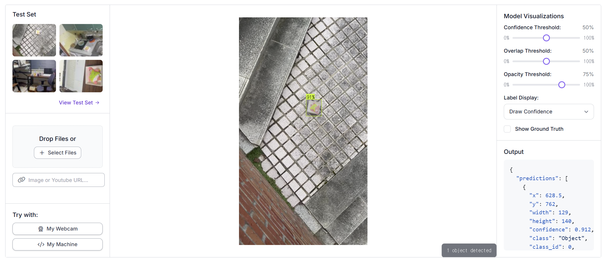
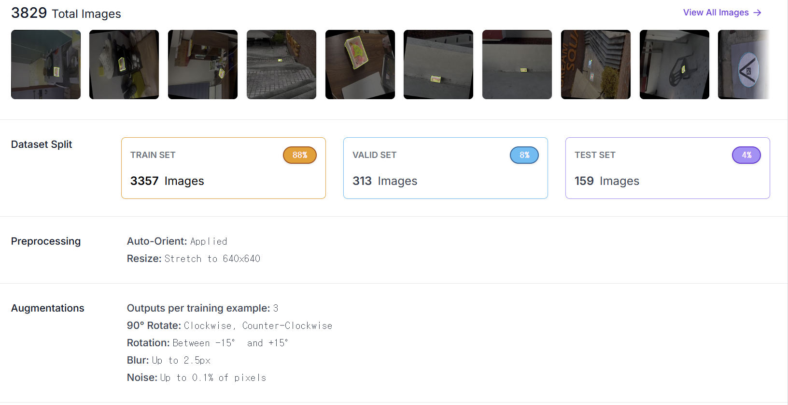
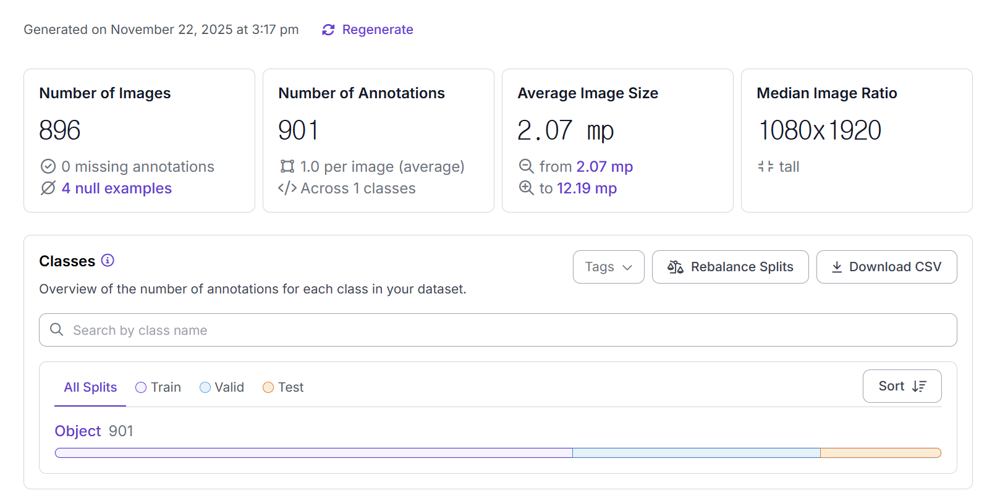

---

## 🧠 모델 학습

Google Colab (GPU: T4) 환경에서 YOLOv8s 모델을 학습하였습니다.

```python
from ultralytics import YOLO

model = YOLO('yolov8s.pt')
model.train(data='data.yaml', epochs=70, imgsz=640)
```

**학습 결과**

| 지표 | 수치 |
|------|------|
| Precision | ~1.00 |
| Recall | ~1.00 |
| mAP50 | ~0.995 |
| mAP50-95 | ~0.90 |

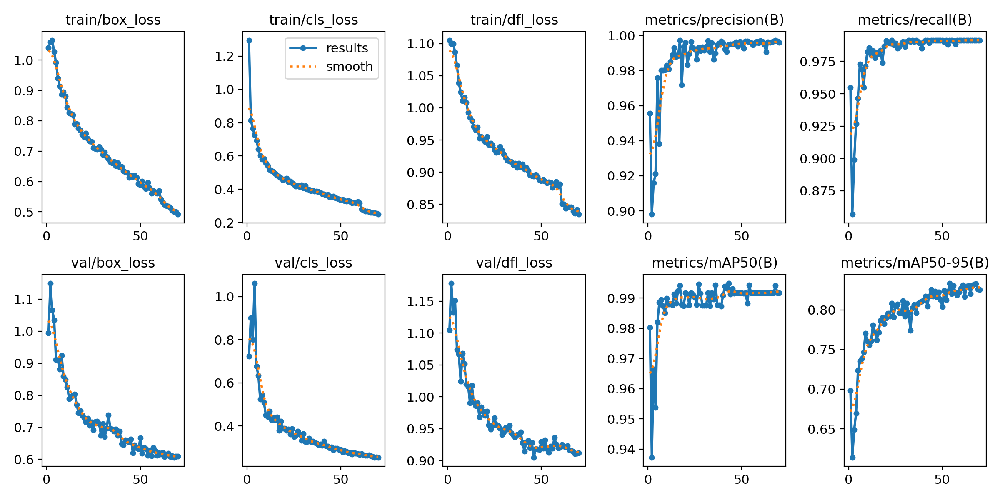
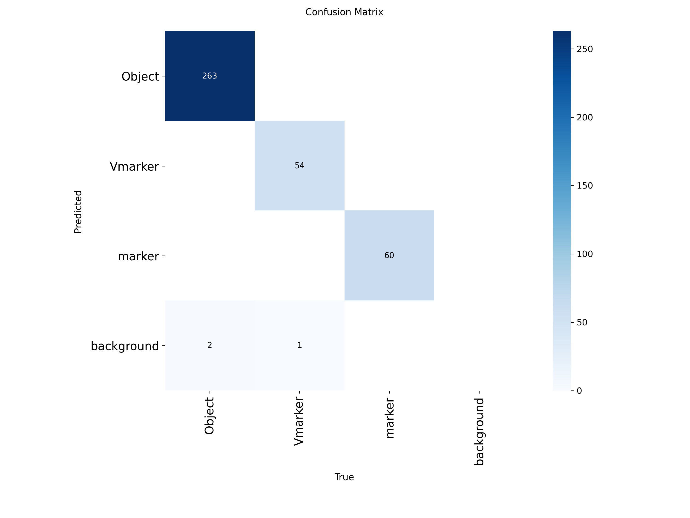
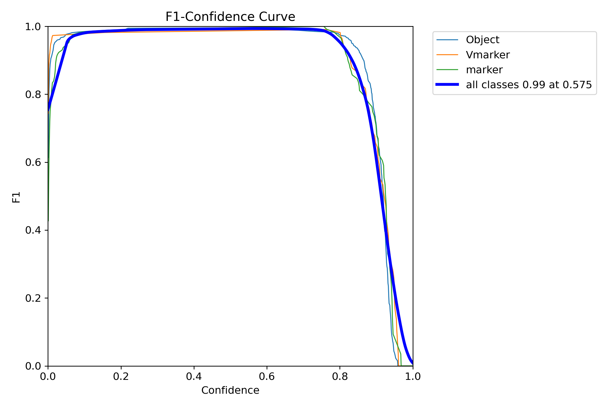

> 학습 코드: [`project_yolo.ipynb`](./train/project_yolo.ipynb)  
> 학습된 모델: [Google Drive에서 다운로드 (best.pt)](여기에_Google_Drive_링크_교체)

---

## 🚨 문제 해결 과정

### 문제 1. 카메라 — 고프로 웹캠 → 파이카메라3 교체

**상황**  
초기에는 고프로를 웹캠 모드로 활용하여 영상을 받아 탐지를 시도하였습니다.

**문제점**
- 영상 딜레이 발생 → 실시간 탐지 불가
- 드론 탑재 시 무게 부담
- 유선 연결 필요 → 드론 운용 제약

**해결**  
파이카메라3 (Raspberry Pi Camera Module 3) 으로 교체

- 라즈베리파이5와 CSI 케이블로 직접 연결 → 유선 문제 해결
- 경량화로 드론 탑재 부담 감소
- 딜레이 대폭 감소 → 실시간 탐지 가능

> 📹 고프로 테스트 영상: [Google Drive](https://drive.google.com/file/d/1HalbnKorBqHC6nhiCObe4z_TvBeBJ_vW/view?usp=drive_link)  
> 📹 파이카메라 가속기 테스트 영상: [Google Drive](https://drive.google.com/file/d/1BuicwWjU81EkGh0u3yliEU6AlP-tuEIg/view?usp=drive_link)

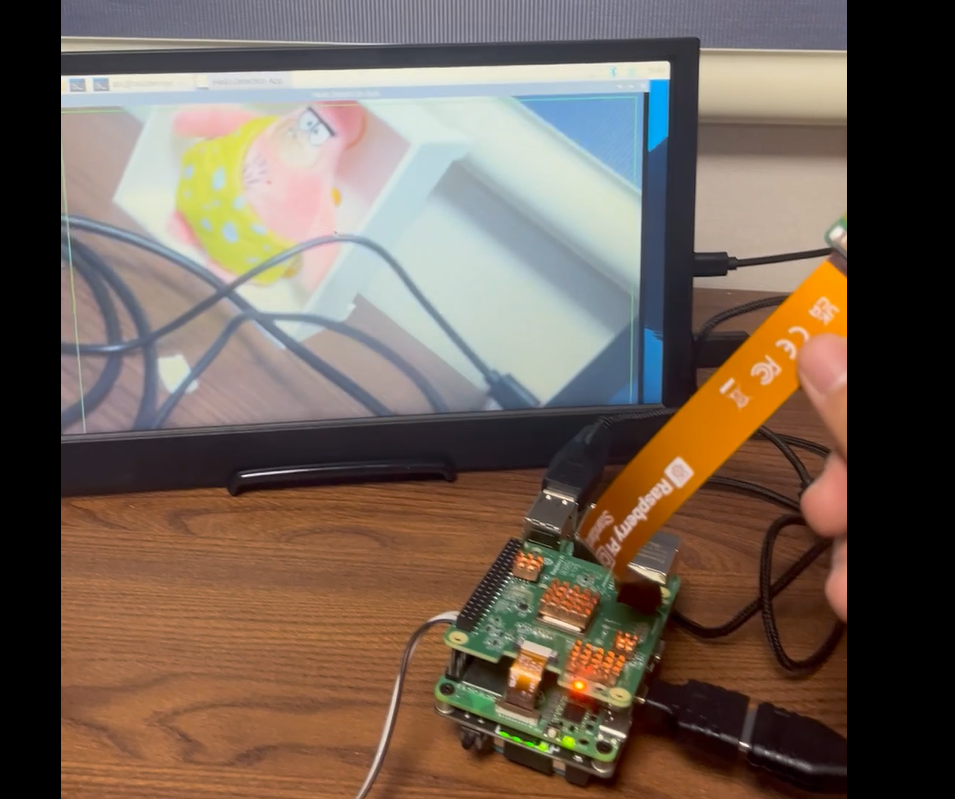

---

### 문제 2. 성능 — CPU 과부하 → Hailo-8 NPU 가속기 탑재

**상황**  
라즈베리파이5 CPU만으로 YOLOv8 탐지 + 마커 인식을 동시에 실행하였을 때 영상 속도가 극도로 느려지는 문제가 발생하였습니다.

**문제점**
- CPU 점유율 거의 100% 상태 지속
- 영상 프레임 저하 → 실시간 탐지 불가
- 발열 문제로 장시간 드론 운용 불가

**해결**  
Hailo-8 NPU 가속기 탑재 후 YOLOv8 모델을 HEF 포맷으로 변환하여 실행

| 항목 | CPU만 | Hailo-8 적용 후 |
|------|-------|----------------|
| CPU 점유율 | ~163% | ~68% |
| 영상 속도 | 매우 느림 | 정상 실시간 |
| 추론 속도 | 느림 | 빠름 |

> 📹 가속기 필요 이유 영상 (CPU만 사용): [Google Drive](https://drive.google.com/file/d/12Y1jtYBfPbwzOfmpxryPejCTi2O-Pnap/view?usp=drive_link)  
> 📹 가속기 적용 후 영상: [Google Drive](https://drive.google.com/file/d/1Xgk8yFk_uwnXUvnShMPyKn_2-aZgy2L0/view?usp=drive_link)

| CPU만 사용 | Hailo-8 적용 후 |
|-----------|----------------|
| 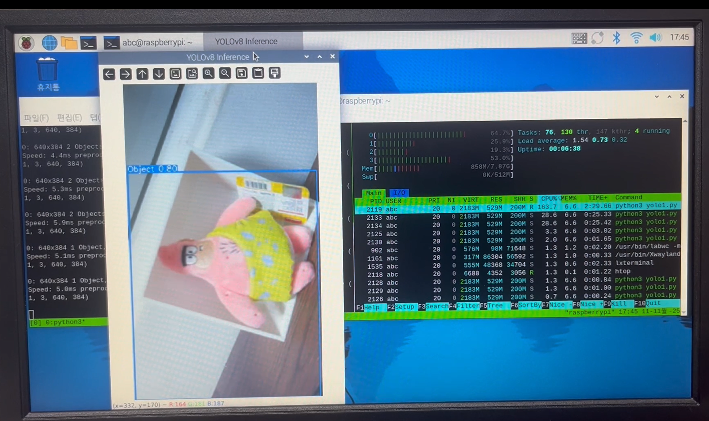 | 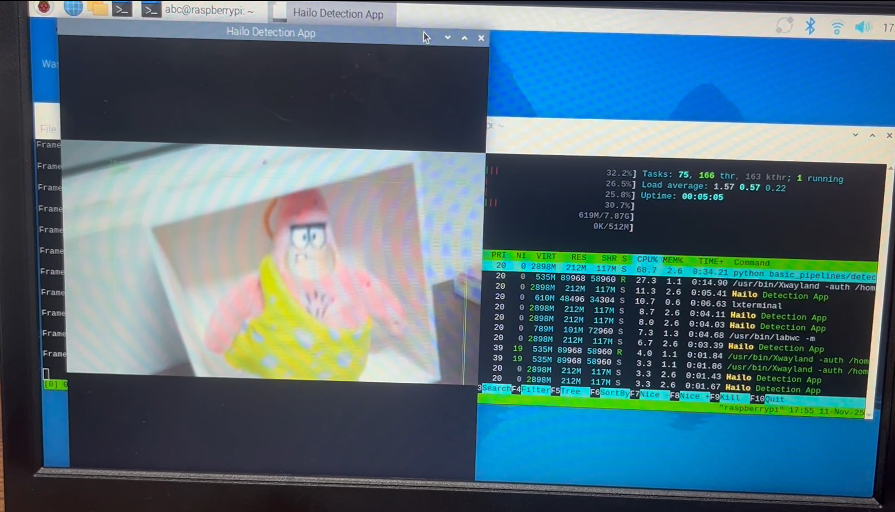 |

---

### 문제 3. HEF 변환 — 로컬 PC 성능 부족 → Google Cloud VM 활용

**상황**  
YOLOv8 모델(best.pt)을 Hailo-8에서 실행하기 위해 HEF 파일로 변환해야 했습니다.  
변환 과정은 **Hailo AI Software Suite (Docker 환경)** 에서 수행되며 고성능 CPU와 대용량 RAM이 필요합니다.

**문제점**
- 로컬 PC 사양으로 Hailo Dataflow Compiler 실행 불가
- Docker 컨테이너 내 컴파일 과정에서 메모리 부족 오류 발생

**해결**  
Google Cloud VM (고성능 인스턴스) 을 대여하여 원격으로 접속 후 변환 작업 수행

```
로컬 PC → Google Cloud VM 원격 접속
→ Docker (Hailo AI Suite) 실행
→ best.pt → ONNX → HAR → HEF 변환
→ HEF 파일 다운로드 → 라즈베리파이5 배포
```

**변환 단계 요약**

1. `best.pt` → `best.onnx` (ONNX 변환)
2. `best.onnx` → `yolov8s.har` (Hailo 모델 파싱)
3. 양자화(FP32 → INT8) + 보정(Calibration)
4. `yolov8s.har` → `yolov8s.hef` (HEF 컴파일)

> HEF 변환 후 Hailo-8 칩에서 INT8 연산으로 저전력 고속 추론이 가능해집니다.

---

## 🍓 라즈베리파이 배포

### 카메라 캘리브레이션
체커보드를 활용하여 파이카메라3의 렌즈 왜곡을 보정하였습니다.

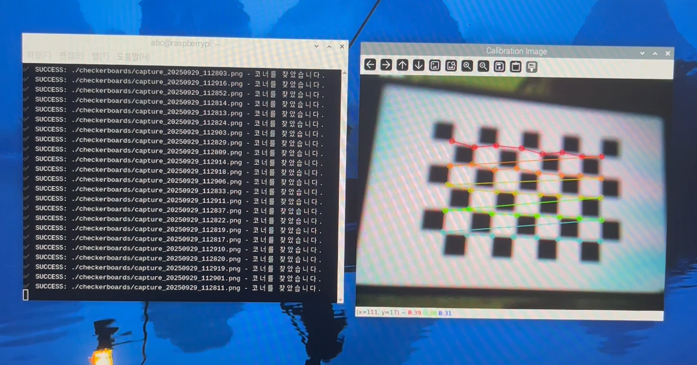

### 마커 인식 (ArUco + Red Cross + V-Marker)
조난자 위치를 드론이 인식할 수 있도록 ArUco 마커, 빨간 십자가, V자 마커를 복합 인식하였습니다.

> 📹 마커 인식 영상: [Google Drive](https://drive.google.com/file/d/1gP4Q_hjwu5kjZAp2R57Ij06CgphE-u5R/view?usp=drive_link)

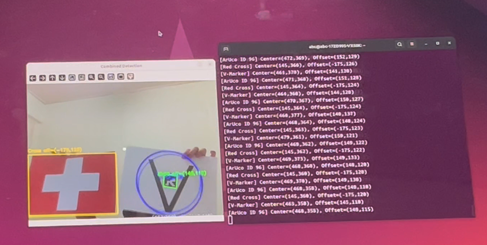

### 최종 테스트
YOLOv8 탐지 + 마커 인식 + Hailo-8 가속을 모두 통합한 최종 시스템 테스트입니다.

> 📹 최종 시연 영상: [Google Drive](https://drive.google.com/file/d/15H-0Fen42zdMt8OzbitXhHGiRKHc8htN/view?usp=drive_link)


---

## 📁 폴더 구조

```
📦 drone-survivor-detection
├── train/
│   └── project_yolo.ipynb   # Colab 학습 코드
├── images/
│   ├── hardware/            # 하드웨어 사진
│   └── results/             # 학습 결과 그래프
├── detect_camera.py          # 로컬 카메라 실시간 탐지
├── requirements.txt
└── README.md
```

---

## 🛠 사용 기술

`Python` `YOLOv8` `Roboflow` `OpenCV` `Hailo-8 NPU` `Raspberry Pi 5`  
`Google Colab` `Google Cloud VM` `Docker` `ArUco Marker`
